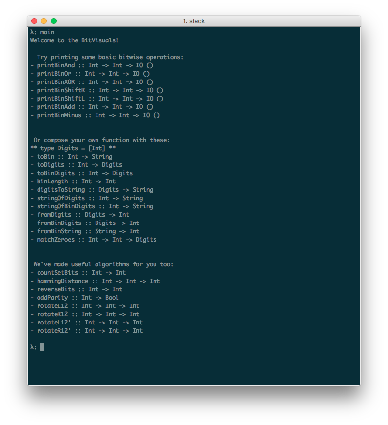

# BitVisuals

A simple tool for visualizing bitwise manipulation inside the Haskell REPL.

Note: "[Int]" is now under the "Digits" type alias.

If you are stuck, trying loading running "main" in the Welcome module. You should see something like the following:

